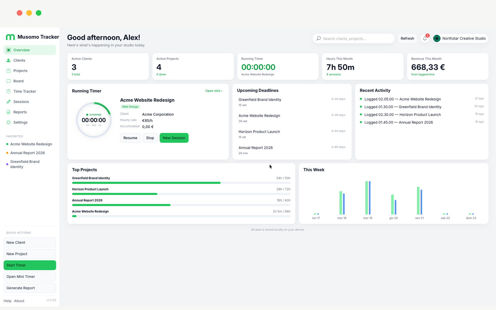
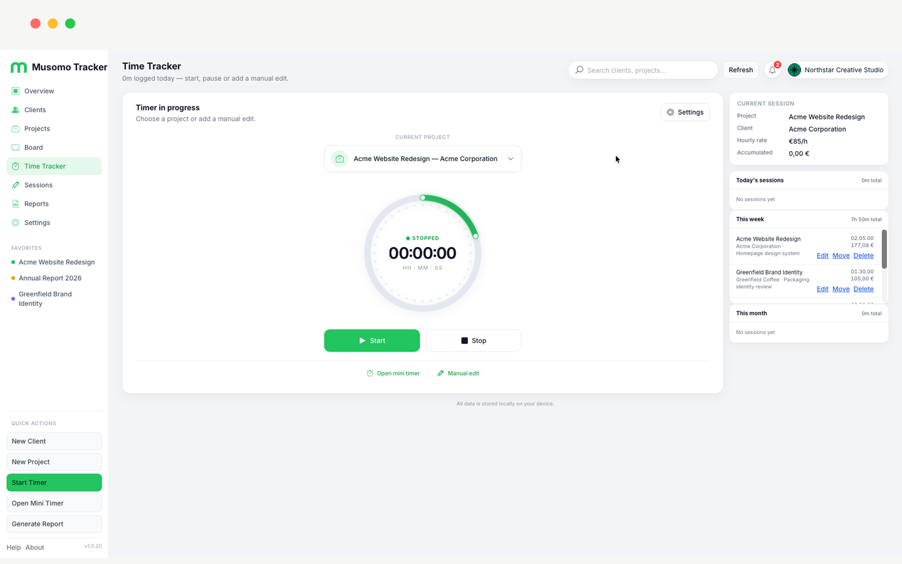
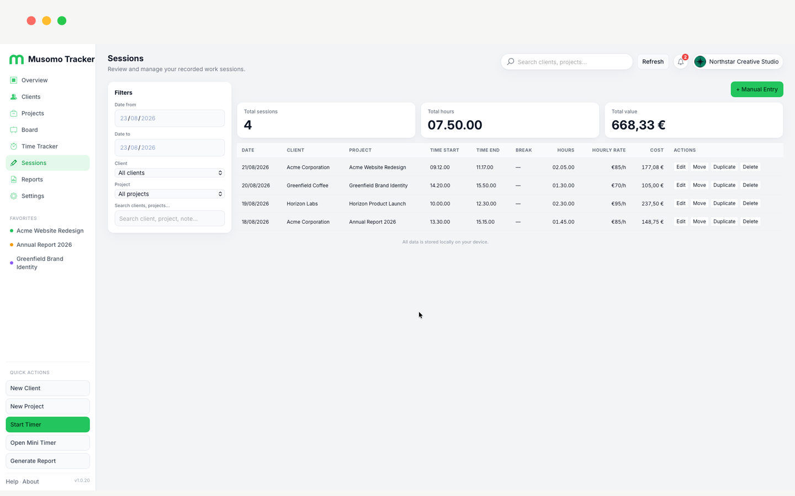
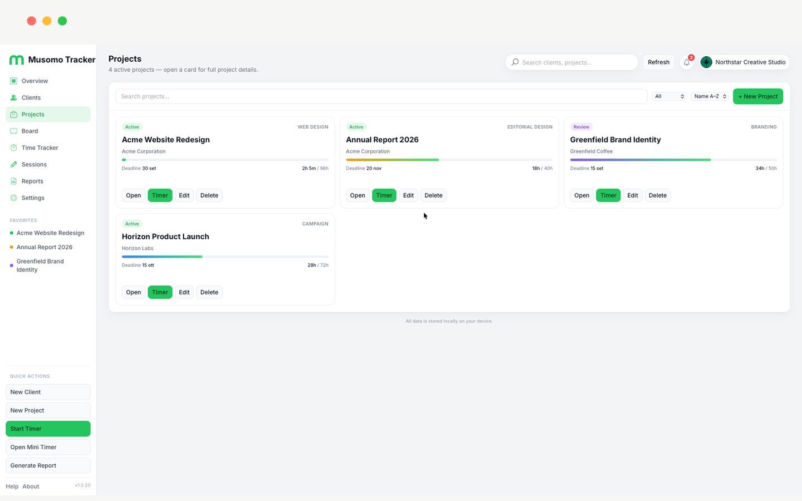
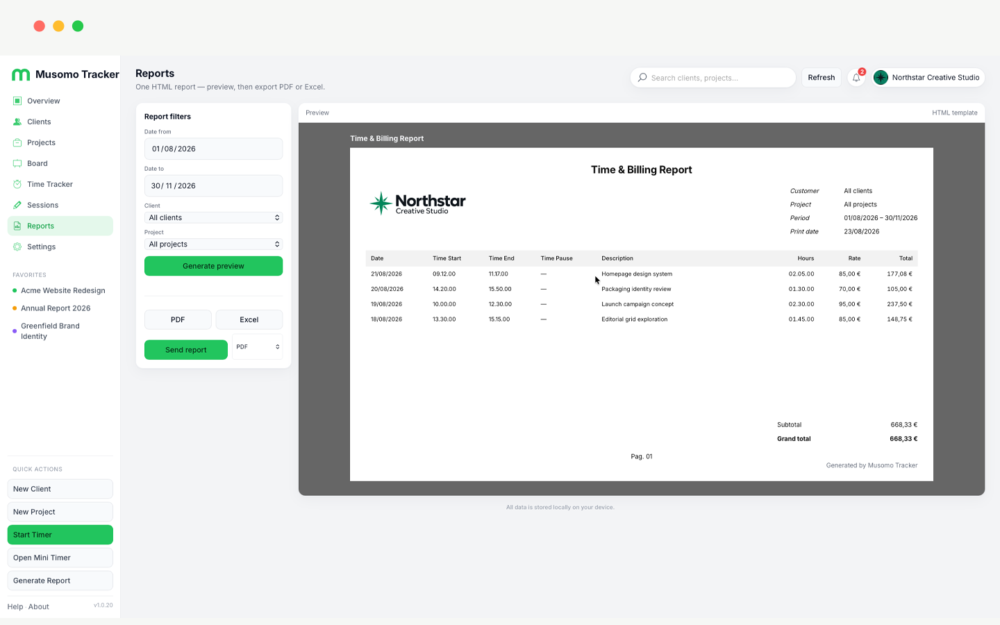
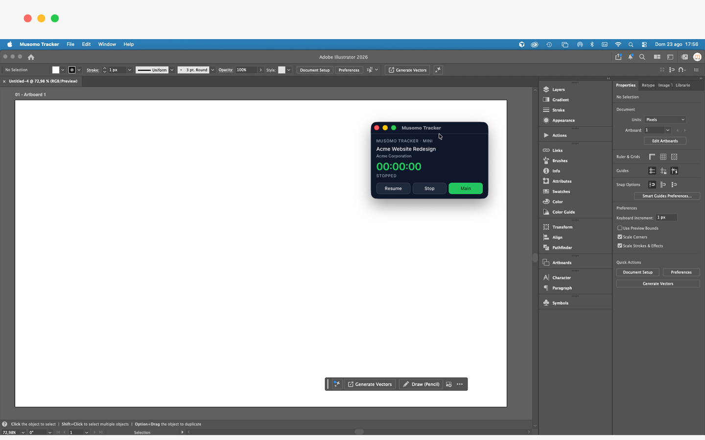

<p align="center">
  
</p>

<h1 align="center">Musomo Tracker</h1>

<p align="center">
  A local-first desktop time tracking and project management app for freelancers and independent professionals.
</p>

<p align="center">
  <strong>Version 1.4.2</strong>
</p>

<p align="center">
  <strong>Official website:</strong> <a href="https://tracker.musomo.net/">https://tracker.musomo.net/</a><br />
  <strong>Downloads:</strong> <a href="https://tracker.musomo.net/#download">https://tracker.musomo.net/#download</a>
</p>

<p align="center">
  <a href="https://tracker.musomo.net/">Website</a> ·
  <a href="https://ko-fi.com/musomo">Support Musomo</a> ·
  <a href="https://github.com/musomo-design/musomo-tracker">Repository</a>
</p>

---

Musomo Tracker helps you manage clients, projects, and billable time — without cloud accounts or subscriptions. All data stays on your device in a local SQLite database.

## What's new in 1.4.2

- **End-of-day dialog** — when a paused timer crosses midnight, yesterday's session is saved at 24:00 and you can start a new session for today or dismiss
- **Automatic backups visible** — auto safety copies now appear in Settings → Restore with clear labels
- **Safer quit** — closing the app with an open timer (including paused) shows the save dialog instead of losing work
- **Dialog reliability** — native macOS dialogs fixed for midnight and close flows

## What's new in 1.4.0

- **Midnight timer split** — live sessions crossing midnight save as two rows (day 1 → 24:00, day 2 continues running or paused); sleep-safe wall-clock logic
- **Overnight manual entry** — when end is before start on the same date, two sessions are created automatically
- **Manual time input** — `HH/MM/SS` digit mask with fixed slashes; black modal backdrop
- **Mini Timer (macOS)** — red closes with save dialog, yellow compact size, green default size; **Don't save** correctly discards the open session
- **Timer reliability** — elapsed time from wall clock; improved sync when returning from background or sleep

## What's new in 1.3.31

- **Manual session entry fixed** — Start/End/Break in 24h `HH:MM:SS`; billable = (End − Start) − Break
- **Time input** — single field with fixed colons; type digits only (e.g. `083000` → `08:30:00`)
- **Break validation** — break cannot be longer than the session window
- **Calculator removed** — cleaner manual entry without the popup

## What's new in 1.1.3

- **Backup & archive** — manual named backups, automatic safety copies before destructive ops (last 10 kept), delete selected backup, readable restore labels
- **Full restore** — archive and demo restore bring back the complete studio profile (company, logos, header/footer); clean database still keeps your current branding
- **Mini Timer** — close button shows save dialog when timer is running; immediate hide when paused or stopped
- **UI polish** — dark charcoal theme consistency, clients table alignment, sidebar nav in dark mode
- **App icon** — new dark full-bleed icon (green **m** on charcoal)

## What's new in 1.1.0

- **Dark theme** — default appearance; light mode still available in Settings
- **Improved sidebar** — clearer navigation and quick actions
- **Mini Timer UX** — opening the mini timer minimizes the main window; **Main** brings it back
- **Multi-page reports** — PDF export with header/footer on every page, custom notes, date format (EU/US)
- **Smarter close flow** — save, save paused, or discard when closing with an active timer
- **Sessions & UI polish** — table styling, project detail views, timer panel actions

## Main features

- **Clients** — contact details, hourly rates, currencies, archive & favorites
- **Projects** — status, deadlines, progress, detail view with tasks
- **Board** — kanban columns with drag-and-drop
- **Time Tracker** — Start, Pause, Stop with break tracking
- **Mini Timer** — compact always-on-top window synced with the main app
- **Sessions management** — filter, edit, duplicate, move; hourly rate per session
- **Reports PDF / Excel** — Time & Billing reports with HTML preview and export
- **Local-first / SQLite** — no server, no account required
- **Privacy** — data stored locally; no analytics or telemetry ([PRIVACY.md](PRIVACY.md))

## Dashboard

<p align="center">
  
</p>

Overview metrics, upcoming deadlines, recent activity, and quick access to timer and reports.

## Time tracking

<p align="center">
  
</p>

Live timer with project context, pause/break support, manual entry, and Mini Timer link.

## Sessions

<p align="center">
  
</p>

View, filter, and edit all time sessions. Set an hourly rate per session and add manual entries.

## Projects

<p align="center">
  
</p>

Projects linked to clients with status, progress, deadlines, and detail views.

## Reports

<p align="center">
  
</p>

Time & Billing reports with filters. Export **PDF** or **Excel**. On macOS, Send Report opens Mail with the attachment — nothing is sent until you confirm.

## Mini Timer

<p align="center">
  
</p>

Always-on-top window for tracking time while working in other apps. Stays in sync with the main application.

---

## Platforms

| Platform | Status |
|----------|--------|
| **macOS** | Primary target (10.13+). Release builds available as signed & notarized `.app` / `.dmg`. |
| **Windows** | Tauri target configured; **not yet verified**. |

## Installation (macOS)

1. Download the release from [GitHub Releases](https://github.com/musomo-design/musomo-tracker/releases) or [tracker.musomo.net/#download](https://tracker.musomo.net/#download)
2. Open the DMG and drag **Musomo Tracker** to Applications
3. Launch the app — demo data loads on first run (replaceable in Settings)

No internet connection required after installation.

## Local data

| Platform | Path |
|----------|------|
| macOS | `~/Library/Application Support/musomo-tracker/` |
| Windows | `%APPDATA%\musomo-tracker\` |

Includes `tracker.db`, automatic backups in `archives/`, and brand assets in `assets/`.

## Backup & Restore

From **Settings → Data**:

- **Manual backup** — name your snapshot; files live in `archives/` on this Mac
- **Automatic backup** — created before clean, demo restore, or archive restore; stored in `archives/auto/` (last 10 kept); visible in the restore list with an **Automatic backup** label
- **Restore from archive** — full studio snapshot including branding; a safety backup is created first
- **Clean database** — wipes clients/projects/tasks/sessions only; keeps your current profile and logos
- **Restore demo** — loads the Northstar demo profile (data + settings)

Regenerate app icons after updating `src/tracker-studio/asset/tracker-app-icon.png`:

```bash
npm run icons:generate
```

## Build from source

For developers with permission to build from this repository:

```bash
git clone https://github.com/musomo-design/musomo-tracker.git
cd musomo-tracker
npm install
npm run build
```

Release artifacts can be staged with:

```bash
bash scripts/stage-dist.sh
# Output: dist/v1.4.2/
```

Signed and notarized macOS builds run via GitHub Actions (`.github/workflows/macos-build-notarize.yml`).

Version is defined in `package.json` and synchronized via `npm run sync-version`.  
Bundle identifier: `net.musomo.tracker`

## Languages

English, Italiano, Español, Français, Deutsch — system default or override in Settings.

## Links

- **Official website:** https://tracker.musomo.net/
- **Downloads:** https://tracker.musomo.net/#download
- **Support Musomo:** https://ko-fi.com/musomo
- **Repository:** https://github.com/musomo-design/musomo-tracker

## Support Musomo Tracker

Musomo Tracker is free and local-first.  
If you find it useful, you can support its development:

[](https://ko-fi.com/K3K01ZCGJ4)

## Privacy

Full policy: [PRIVACY.md](PRIVACY.md)

## License

Musomo Tracker is **proprietary software**. Copyright © 2026 Musomo. All rights reserved. See [LICENSE](LICENSE).

Third-party open-source components: [THIRD_PARTY_NOTICES.md](THIRD_PARTY_NOTICES.md).
